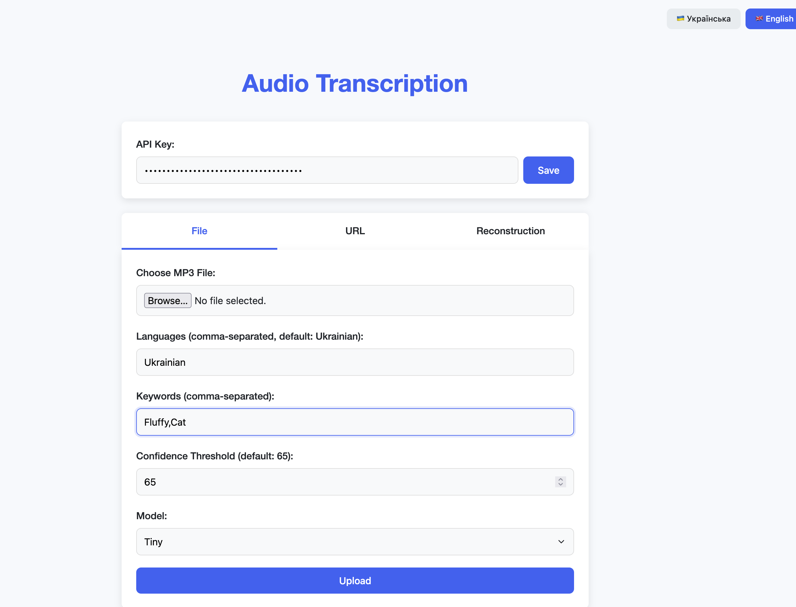

# Audio Transcription & Text Reconstruction Service

[](https://opensource.org/licenses/MIT)
[](https://www.python.org/downloads/)

A production-ready Flask application for audio transcription using OpenAI's Whisper models and text reconstruction with Google's Gemma models. Provides both REST API endpoints and a simple web interface.

## Key Features

- 🎙️ Audio transcription for multiple languages (Ukrainian, English, etc.)
- 🔍 Keyword spotting with confidence thresholds
- ⚡ GPU acceleration support (CUDA)
- 📝 Text reconstruction using Gemma language models
- 🔐 API key authentication
- 📈 Rate limiting and request logging
- 🧩 Modular architecture with model caching
- 🌐 Both file upload and remote URL processing
- 📊 Detailed logging and performance metrics

## Table of Contents

- [Installation](#installation)
- [Configuration](#configuration)
- [Usage](#usage)
- [API Documentation](#api-documentation)
- [Deployment](#deployment)
- [Contributing](#contributing)
- [License](#license)

## Installation

### Prerequisites

- Python 3.8+
- FFmpeg (for audio processing)
- CUDA-enabled GPU (recommended for better performance)

```bash
# Clone repository
git clone https://github.com/yourusername/audio-transcription-service.git
cd audio-transcription-service

# Create virtual environment
python -m venv venv
source venv/bin/activate  # On Windows: venv\Scripts\activate

# Install dependencies
pip install -r requirements.txt

# Install FFmpeg (Ubuntu/Debian)
sudo apt-get install ffmpeg
```

## Configuration

Create `.env` file in the project root:

```ini
# Core Configuration
FLASK_ENV=production
FLASK_HOST=0.0.0.0
FLASK_PORT=8080

# File Handling
UPLOAD_FOLDER=./uploads
ALLOWED_EXTENSIONS=mp3,wav
MAX_CONTENT_LENGTH=52428800  # 50MB

# Security
API_KEY_ENABLED=true
API_KEY=your-secure-key-here

# Features
UI_ENABLED=true
```

Key Environment Variables:
- `API_KEY`: Secret key for API authentication
- `CONFIDENCE_THRESHOLD`: Default confidence level for keyword matching (0-100)
- `GPU_MEMORY_LIMIT`: Set VRAM allocation limit for CUDA

## Usage

### Running the Application

```bash
# Development mode
FLASK_ENV=development flask run --port 8080

# Production mode (using Gunicorn)
gunicorn --config gunicorn_config.py app:app
```

### Health Check
```bash
curl http://localhost:8080/health
```

## API Documentation

### Endpoints

#### POST `/transcribe`
Transcribe audio from file upload

**Request:**
```bash
curl -X POST -H "X-API-Key: your-api-key" \
  -F "file=@audio.mp3" \
  http://localhost:8080/transcribe
```

**Parameters:**
- `file`: Audio file to transcribe (MP3/WAV)
- `model`: Whisper model size (base, small, medium, large)
- `lang`: Comma-separated languages (e.g., "Ukrainian,English")
- `keywords`: Comma-separated keywords to monitor
- `confidence_threshold`: Match confidence percentage (0-100)

#### POST `/pull`
Transcribe audio from remote URL

**Request:**
```json
{
  "file_url": "https://example.com/audio.mp3",
  "model": "base",
  "languages": ["Ukrainian"],
  "keywords": ["important"],
  "confidence_threshold": 85
}
```

#### POST `/reconstruct`
Improve transcription text using Gemma

**Request:**
```json
{
  "transcription": "raw text from whisper",
  "template": "formal report format"
}
```

### Response Format
```json
{
  "transcriptions": {
    "Ukrainian": "full transcribed text",
    "English": "translated text"
  },
  "keyword_spots": {
    "important": [
      {
        "word": "important",
        "confidence": 92,
        "time_mark": 23.45,
        "context": "this is important because..."
      }
    ]
  },
  "processing_time": 4.56
}
```

## Web Interface

Access the simple web UI at `http://localhost:8080` when enabled (set `UI_ENABLED=true`):



## Deployment

### Production Setup
1. Use Gunicorn with the provided configuration:
   ```bash
   gunicorn --config gunicorn_config.py app:app
   ```

2. Recommended environment variables for production:
   ```ini
   FLASK_ENV=production
   API_KEY_ENABLED=true
   MAX_CONTENT_LENGTH=52428800
   ```

### Docker
```sh
docker pull stremovskyy/transcription-app:latest
docker run -d --gpus all -p 8080:8080 --name transcriptor  --restart always stremovskyy/transcription-app
```

## Contributing

Contributions are welcome! Please follow these steps:
1. Fork the repository
2. Create a feature branch (`git checkout -b feature/your-feature`)
3. Commit your changes
4. Push to the branch
5. Open a Pull Request

## License

This project is licensed under the MIT License - see the [LICENSE](LICENSE) file for details.

## Acknowledgments

- OpenAI Whisper models
- Google Gemma models
- Flask community for excellent web framework
